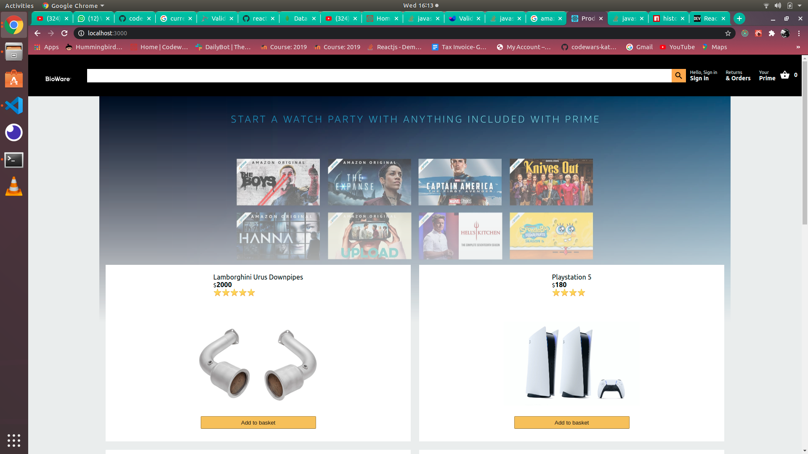
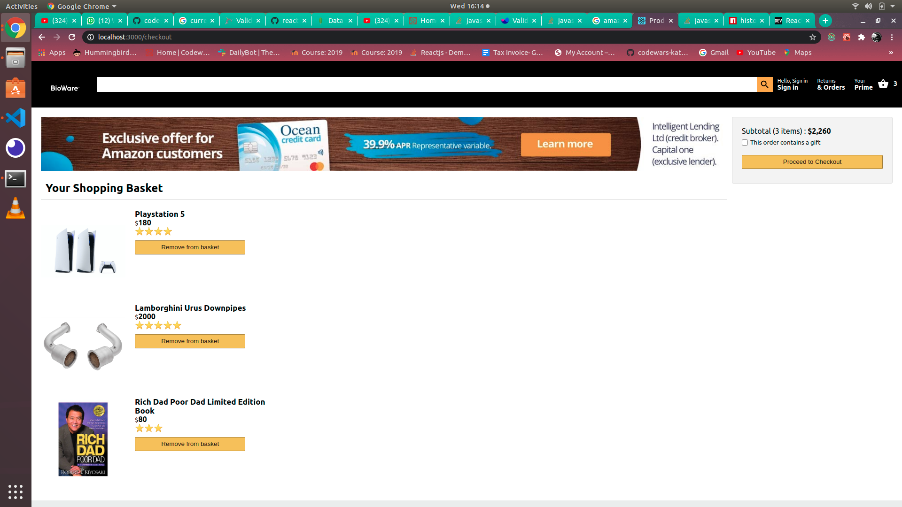
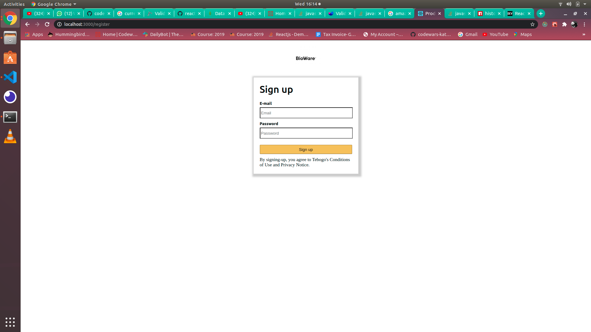
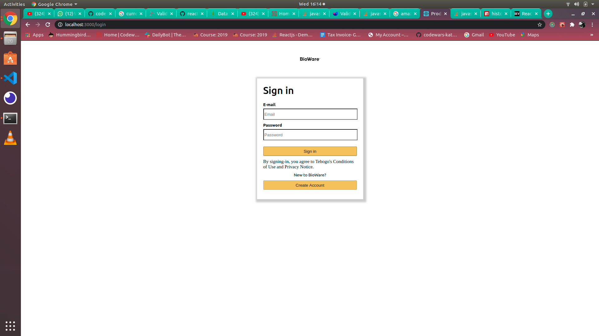

# How to run the project

- Clone the github repo

- Install the node_modules using npm install

- You will need to go to the Mongodb website and create an account and if you need access to my database to read and write to the database you need to send me an email at "tebogo1686@gmail.com" or you can create an env file in the file then create a cluster and then put the connection string into you env file. you can run the server by accessing the backend folder and running yarn start or npm start and you can run the whole app by the command yarn start but out of the backend folder

- Then run it locally using npm start

# Homepage

- 

# Checkout

- 

# Register

- 

# Sign in

