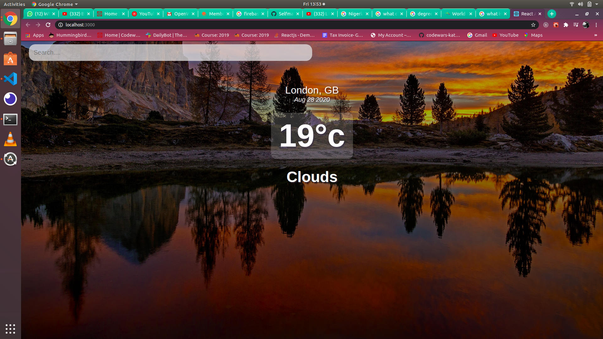
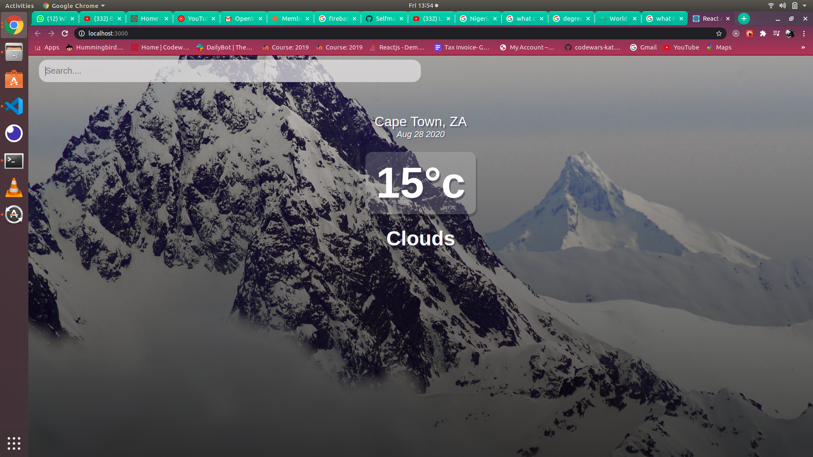

# How to run the app?

- First you need to clone the app into your working machine

- Open the project folder using visual studio code and then open the terminal and access the project directory

- On the terminal write the command _npm install_ to install the needed packages to run the app

- After installing the packages you can now run the app using npm start

- From there the app will be running into the search box you can type any country or place in the world earth and then you can get the place's realtime weather **Make sure you have an active internet connection**

- 

- 
